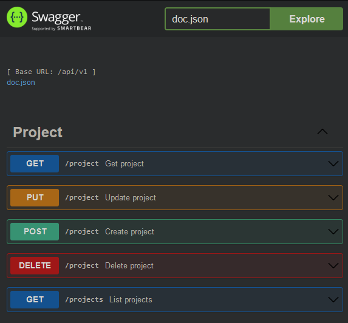

# GoFreela

GoFreela is a simple solution designed to help freelancers and independent professionals efficiently manage their tasks and projects. With comprehensive features, this API enables freelancers to streamline their workflow, track project progress, and ensure the timely completion of tasks.

## 💻 Techs

- [Go (Golang)](https://go.dev/)
- [Gin](https://github.com/gin-gonic/gin)
- [Gorm](https://gorm.io/)
- [SQLite](https://www.sqlite.org/)
- [Swaggo (Swagger)](https://github.com/swaggo/swag)

## 🎨 Images



## 🚀 Getting Started

Follow these instructions to get GoFreela up and running on your local machine for development and testing purposes.

### Installation

1. Clone the repository:

   ```bash
   git clone https://github.com/raulval/gofreela.git
   cd gofreela
   ```

2. Install dependencies:

   ```bash
   go mod download
   ```

### Usage

1. Run the application:

   ```bash
   make run

   # or with swagger documentation generation

   make
   ```

2. Access the API documentation at **<http://localhost:8080/swagger/index.html>** in your web browser.

## 🐳 Docker Support

To run GoFreela in a Docker container, follow these steps:

1. Build the Docker image:

```bash
docker build -t gofreela-api .
```

2. Run the Docker container:

```bash
docker run -p 8080:8080 gofreela-api
```

## 📝 License

This project is licensed under the MIT License - see the [LICENSE](LICENSE) file for details.
